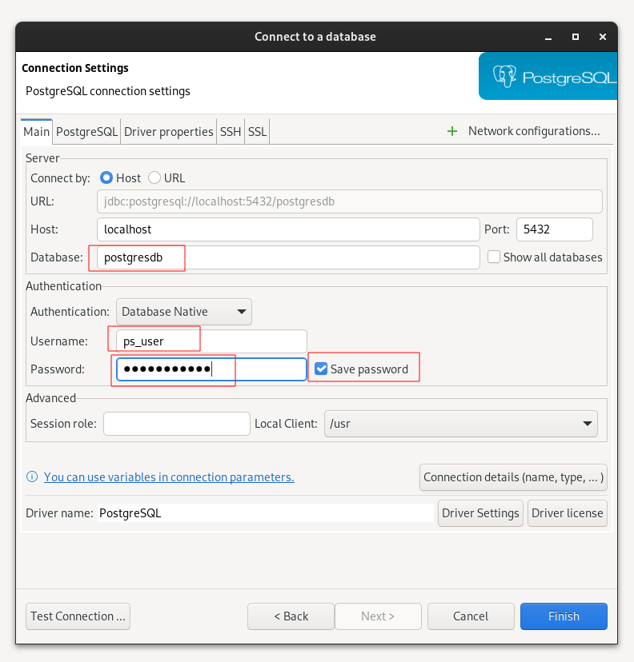

# Database Instructions

## Requirements

* Kubernetes cluster
  
  Follow these instructions to deploy a Kubernetes cluster as a
  [Local Deployment](https://github.com/kubearchive/kubearchive/blob/main/README.md#local-deployment).
* go
  
  [Download and install go](https://go.dev/doc/install)
* psql
  ```bash
  $ sudo dnf install postgresql
  $ psql --version
  psql (PostgreSQL) 15.6
  ```
* DBeaver Community (optional)
  
  A SQL client is recommended to interact easily with the database, [DBeaver Community](https://dbeaver.io/).

## Manual Deployment

The PostgreSQL manual deployment consists of two parts: First, deploy the database infrastructure and then, using a script, create a table in the database and populate it.

### Deploy the Database Infrastructure

* Create a Secret with the database details.
There are two ways to create this secret.
  1) Via kubectl command
  2) Apply the `postgres-secret.yaml`
1) Via kubectl command
```bash
$ kubectl create secret generic postgres-secret -n [namespace] \
--from-literal=POSTGRES_DB="[db_name]" --from-literal=POSTGRES_USER="[db_user]" \ 
--from-literal=POSTGRES_PASSWORD="[db_pass]"
```
   Replace the `[db_name]`, `[db_user]` and `[db_pass]` with the values that you choose for your database.
   Check your secret
```bash
$ kubectl describe secret postgres-secret -n [namespace]
Name:         postgres-secret
Namespace:    database
Labels:       <none>
Annotations:  <none>

Type:  Opaque

Data
====
POSTGRES_DB:        8 bytes
POSTGRES_PASSWORD:  7 bytes
POSTGRES_USER:      7 bytes
```

2) Apply the `postgres-secret.yaml`
Add the configuration parameters for the database in the `data` section. The values had to be encoded in base64.
```bash
$ echo -n "postgresdb" | base64
cG9zdGdyZXNkYg==
```
```yaml
# ...
data:
  POSTGRES_DB: <db_name> # postgresdb - base64
  POSTGRES_USER: <db_user> # admin or ps_user - base64
  POSTGRES_PASSWORD: <db_pass> # a secure password - base64
```
Apply the Secret configuration to the cluster.
```bash
$ kubectl apply -f postgres-secret.yaml -n [namespace]
secret/postgres-secret created
```
* Create a PersistentVolume. 

The file `psql-pv.yaml` has the PersistentVolume definition, the `spec.capacity.storage` is set to `10Gi` in the file.
Apply the PersistentVolume definition to the cluster.
```bash
$ kubectl apply -f psql-pv.yaml -n [namespace]
persistentvolume/postgres-volume created
```
* Create a PersistentVolumeClaim.

The file `psql-claim.yaml` has the PersistentVolumeClaim definition. The `spec.resources.request.storage` is set to `10Gi` in the file.
Apply the PersistentVolumeClaim definition to the cluster.
```bash
$ kubectl apply -f psql-claim.yaml -n [namespaces]
persistentvolumeclaim/postgres-volume-claim created
```
Check the pvc status.
```bash
$ kubectl get pvc -n [namespace]
NAME                    STATUS   VOLUME            CAPACITY   ACCESS MODES   STORAGECLASS   VOLUMEATTRIBUTESCLASS   AGE
postgres-volume-claim   Bound    postgres-volume   10Gi       RWX            manual         <unset>                 43s
```
If everything is correct, the `STATUS` should be `Bound`.
* Create a PostgreSQL Deployment
  
The file `ps-deployment.yaml` has the Deployment definition. The `spec.replicas` is set to `1` in the file. The image used is `postgres:16` but can be changed to test other versions.
Apply the Deployment definition to the cluster.
```bash
$ kubectl apply -f ps-deployment.yaml -n [namespace]
deployment.apps/postgres created
```
* Create a Service
  
The file `ps-service.yaml` has the Service definition.
Apply the Service definition to the cluster:
```bash
$ kubectl apply -f ps-service.yaml -n [namespace]
service/postgres created
```
* Check the database infrastructure.
```bash
$ kubectl get all -n [namespace]
NAME                            READY   STATUS    RESTARTS   AGE
pod/postgres-65db968757-ncnvk   1/1     Running   0          54s

NAME                 TYPE        CLUSTER-IP      EXTERNAL-IP   PORT(S)          AGE
service/kubernetes   ClusterIP   10.96.0.1       <none>        443/TCP          8m53s
service/postgres     NodePort    10.96.248.178   <none>        5432:31047/TCP   19s

NAME                       READY   UP-TO-DATE   AVAILABLE   AGE
deployment.apps/postgres   1/1     1            1           54s

NAME                                  DESIRED   CURRENT   READY   AGE
replicaset.apps/postgres-65db968757   1         1         1       54s
```

* Test the connection to the Database.
  
Identify the PostgreSQL pod.
```bash
$ kubectl get pods -n [namespace]
NAME                        READY   STATUS    RESTARTS   AGE
postgres-65db968757-ncnvk   1/1     Running   0          2m38s
```

```bash
$ kubectl exec -it [postgres_pod] -n [namespace] -- psql -h localhost -U [db_user] --password -p 5432 [db_name]
```
Replace the `postgres_pod`, `db_user` and `db_name` with the values from `postgres-secret.yaml`. The `--password` prompts for the password interactively.
```bash
$ kubectl exec -it postgres-65db968757-ncnvk -- psql -h localhost -U ps_user --password -p 5432 postgresdb
Password: 
psql (16.3 (Debian 16.3-1.pgdg120+1))
Type "help" for help.

postgresdb=# 
```
### Create a Table and Populate the Database

The script `init_db.go` will create a table in the database and will insert the test objects from `test_objects.sql`
* Add the database access configuration. The values are the same from the `postgres-secret.yaml`.
```go
const (
	host     = "localhost"
	port     = 5432
	user     = // the db_user from postgres-secret.yaml, ie: "admin", "ps_user".
	password = // the db_password from postgres-secret.yaml
	dbname   = // the db_name from postgres-secret.yaml, ie: "postgres", "test_db".
)
```
* Run the script
```bash
$ go run init_db.go
table test_objects created in the DB.
testdata from test_objects.sql inserted in the DB.
```
## SQL Queries (Examples)
These queries can be executed from the database.
Connect to the database.
```bash
$ kubectl exec -it [postgres_pod] -- psql -h localhost -U [db_user] --password -p 5432 [db_name]
```
```sql
SELECT * FROM test_objects;
```
```sql
SELECT * FROM test_objects WHERE kind='Job';
```
```sql
SELECT * FROM test_objects WHERE data::jsonb->>'kind'='Job';
```
## Configure DBeaver
* Create a port-forward in a new terminal tab.
```bash
$ kubectl port-forward -n [namespace] svc/postgres 5432:5432
```
* DBeaver settings
  
  Go to `Database` > `New Database Connection`.
  Select `PostgreSQL`.

  Fill the connection parameters with the values from `postgres-secret.yaml`. 
  
  Click on the `Finish` button.

  

  Click right on the new database connection and click on `Connect`. 
  
  The check symbol will change from grey to green to indicate that the client is connected to the database.

  

  Click on the drop down to navigate the database.
  
  