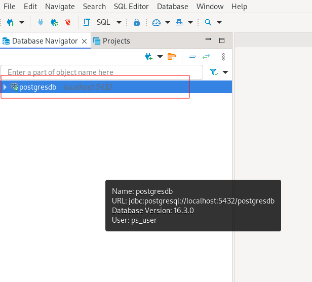
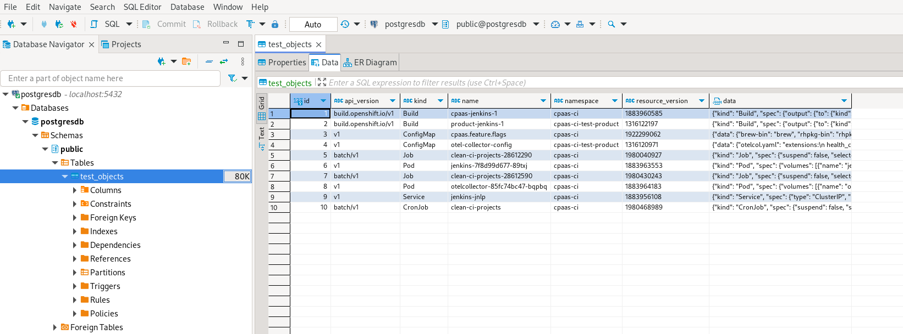

# Database optionals

## Configure a SQL client: DBeaver

Install [DBeaver Community](https://dbeaver.io/).

### Configure DBeaver

1. Create a port-forward in a new terminal tab.

  ```bash
  $ kubectl port-forward -n kubearchive svc/kubearchive-database 5432:5432
  ```

1. DBeaver settings.

   * Go to `Database` > `New Database Connection`. Select `PostgreSQL`.
     Fill the connection parameters with the values from `ps-secret.yaml`.
     Click on the `Finish` button.

     

   * Click right on the new database connection and click on `Connect`.
     The check symbol will change from grey to green to indicate that the client is connected to the database.

     

   * Click on the drop down to navigate the database.

     

## SQL Queries (Examples)

These queries can be executed from the database.
Connect to the database.

```bash
kubectl exec -it  $(kubectl get -n kubearchive pods --no-headers -o custom-columns=":metadata.name" | grep database) -n kubearchive -- psql -h localhost -U ps_user --password -p 5432 postgresdb
```

```sql
SELECT * FROM resource;
```

```sql
SELECT * FROM resource WHERE kind='Job';
```

```sql
SELECT * FROM resource WHERE data::jsonb->>'kind'='Job';
```
